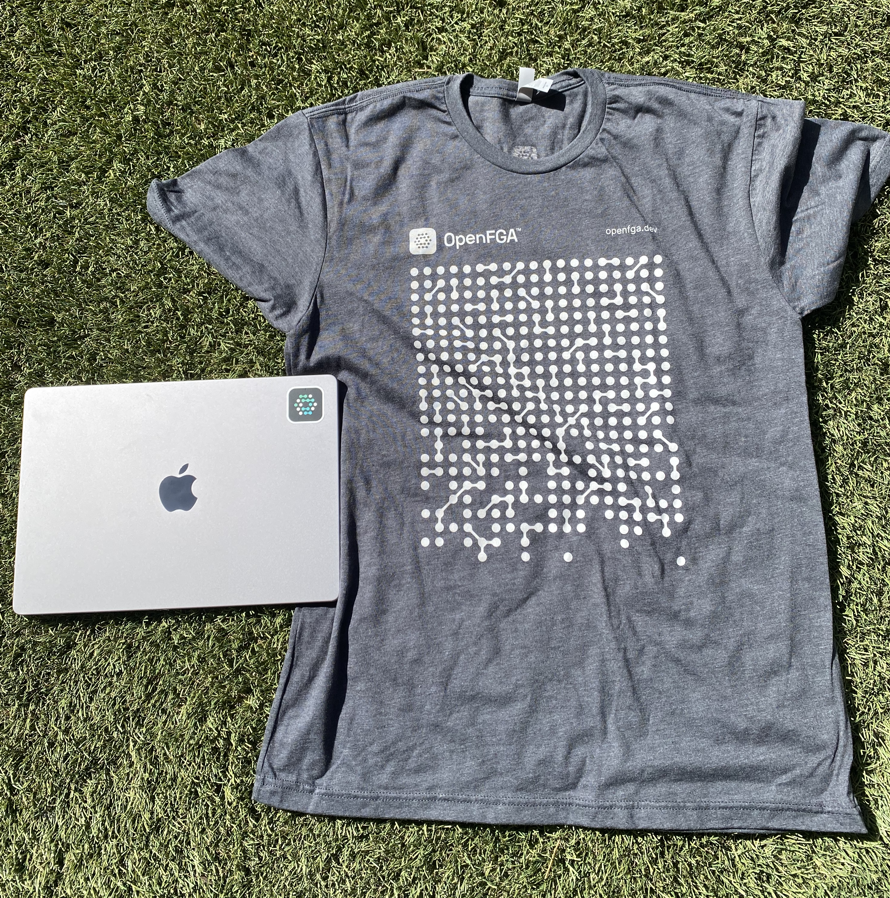

Welcome to the OpenFGA Feedback repository. This repository is home to the OpenFGA Discussions board.

- To ask questions, request enhancements and provide feedback on the product, post in [Discussions](https://github.com/orgs/openfga/discussions).
- To chat with our community use [Discord](https://discord.gg/8naAwJfWN6).
- To keep up to date with current news, follow OpenFGA on [Twitter](https://twitter.com/openfga).
- To learn about OpenFGA, take a look at [our documentation](https://openfga.dev/docs).
- To report issues in a repository, use the Github issues section in that repository
- To contribute, check out the [contribution guidelines](https://github.com/openfga/.github/blob/main/CONTRIBUTING.md).

Tips for getting the most out of your discussions post:

1. Include code examples! Even better if you can add a [Playground](https://play.fga.dev) link.
2. Let us know what steps you've already tried.
3. Link to any relevant GitHub issues or other discussions posts.

# Community Projects

[Quarkus Extension for Zanzibar Style Fine Grained Authorization](https://github.com/kdubb/quarkus-zanzibar-extensions)
[OpenFGA & Auth0 FGA for ASP.NET Core + Worker Services](https://github.com/Hawxy/Fga.Net)

# OpenFGA Swag

We designed a OpenFGA [sticker](brand-assets/openfga-sticker.ai) and [t-shirt](brand-assets/openfga-tshirt.ai) that you can get printed if you want 😀.

We ordered [this RealThread model](https://www.realthread.com/products/next-level-apparel-6210-premium-cvc-crew?color=charcoal&side=front) for t-shirts, and [die cut StickerMule 2" x 2" stickers](https://www.stickermule.com/products/die-cut-stickers).
